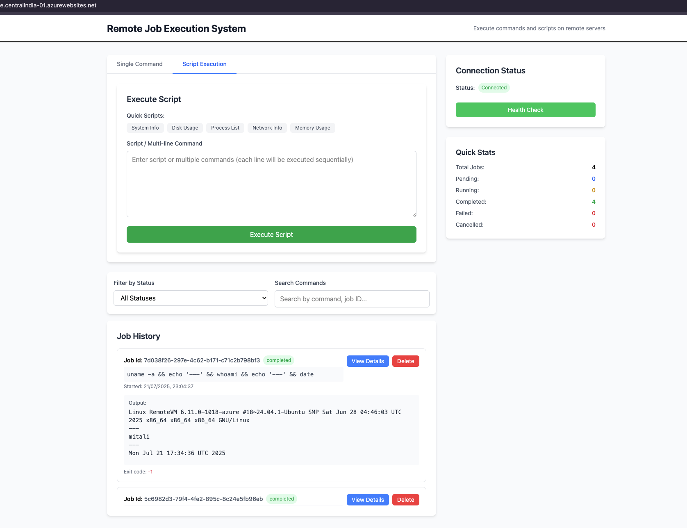

# Remote Job Execution System

A full-stack web application for executing commands and scripts on remote servers. The system provides a modern React frontend for job management and a Node.js/Express backend for secure remote execution with database persistence.

## Screenshot



## 🚀 Features

### Frontend (React + Vite)
- **Command Execution**: Execute single commands on remote servers
- **Script Execution**: Run multi-line scripts with preset templates
- **Real-time Job Monitoring**: Track job status and view outputs in real-time
- **Job History**: Complete history of executed jobs with filtering and search
- **Modern UI**: Clean, responsive interface built with Tailwind CSS
- **Error Handling**: Comprehensive error display and management

### Backend (Node.js + Express)
- **SSH Command Execution**: Secure remote command execution via SSH2
- **Job Management**: Create, track, and manage remote job execution
- **MySQL Persistence**: Store job history, status, and results
- **RESTful API**: Clean API endpoints for frontend integration
- **Async Processing**: Non-blocking command execution
- **Job Cancellation**: Cancel running jobs
- **Health Monitoring**: System health checks and status endpoints

## 🏗️ Architecture

```
┌─────────────────┐    HTTP/REST API    ┌─────────────────┐    SSH    ┌─────────────────┐
│                 │◄──────────────────►│                 │◄─────────►│                 │
│  React Frontend │                    │ Node.js Backend │           │  Remote Server  │
│   (Port 5173)   │                    │   (Port 3000)   │           │                 │
└─────────────────┘                    └─────────────────┘           └─────────────────┘
                                                │
                                                │ SQL
                                                ▼
                                        ┌─────────────────┐
                                        │                 │
                                        │ MySQL Database  │
                                        │                 │
                                        └─────────────────┘
```

## 📋 Prerequisites

- **Node.js** 16+ 
- **MySQL** 8.0+
- **Git**
- **SSH access** to target remote server

## 🛠️ Installation & Setup

### 1. Clone the Repository
```bash
git clone https://github.com/heymitali/remote-job-execution-system.git
cd remote-job-execution-system
```

### 2. Backend Setup

```bash
cd backend

# Install dependencies
npm install

# Set up MySQL database
mysql -u root -p < database/setup.sql

# Create environment file
cp .env.example .env
# Edit .env with your configuration
```

```bash
# Start the backend server
npm start
# Or for development with auto-reload
npm run dev
```

### 3. Frontend Setup

```bash
cd frontend

# Install dependencies
npm install

# Start the development server
npm run dev
```

The application will be available at:
- **Frontend**: http://localhost:5173
- **Backend API**: http://localhost:3000
- **Health Check**: http://localhost:3000/health

## 📝 License

This project is licensed under the MIT License - see the [LICENSE.md](LICENSE.md) file for details.

## 👥 Authors

- **Mitali Singh** - [@heymitali](https://github.com/heymitali)
